# Food Ordering App For Canteen (Cassia)

The existing method of ordering food involves standing in a queue in order to purchase token for the food we wish to have. It is a tiring and a time-consuming process. Thus the system makes this entire purchase digital with online payment. The user is provided with an application where he/she is listed with all food items available in the canteen at that particular time from which they can select the items they want. The user is requested to have the required cash in the wallet before placing order. Wallet money can be refilled using e-payment. Once the order is confirmed, order details is updated in the order history listing page with a button to be clicked by the waiter after providing the food. The quantity of food available is updated by an in-charge in the canteen using the admin application. The admin can add a new food item, update the quantity of available food item or remove a food item when it gets over. This will avoid users from ordering items that are already finished.

## Architecture

## Screenshots

## Login & Signup

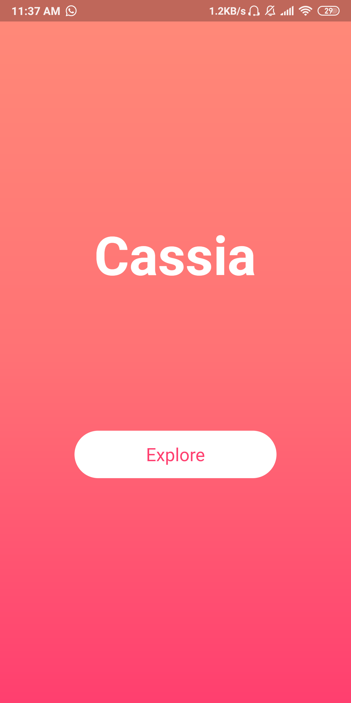
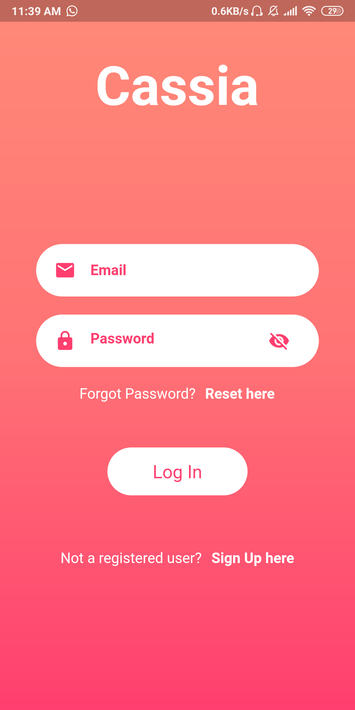
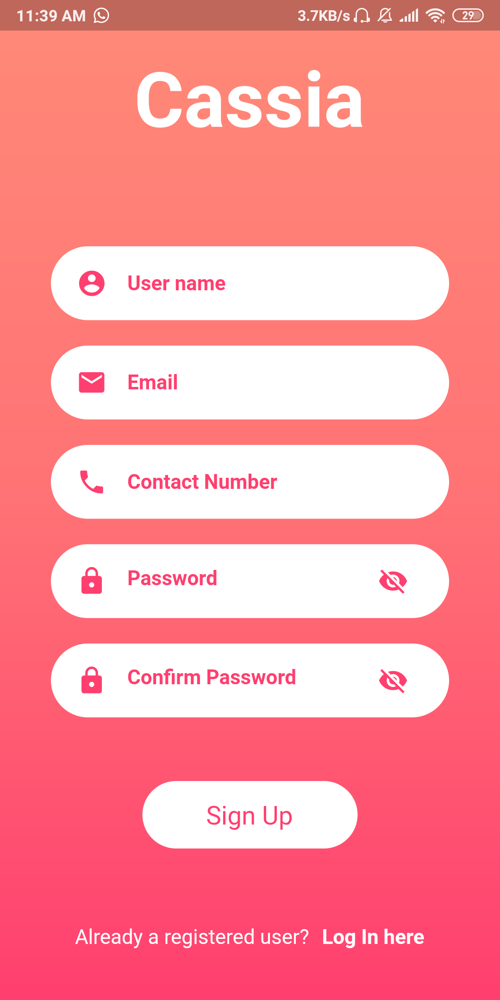
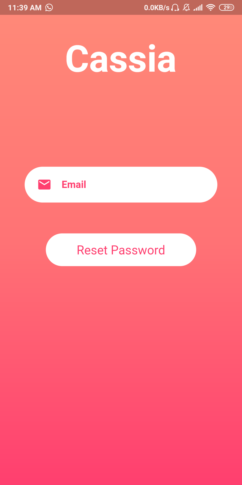

## Place an order

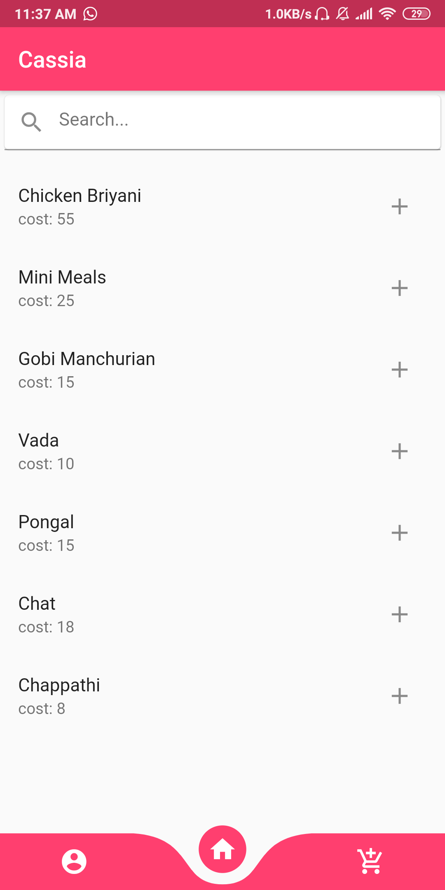
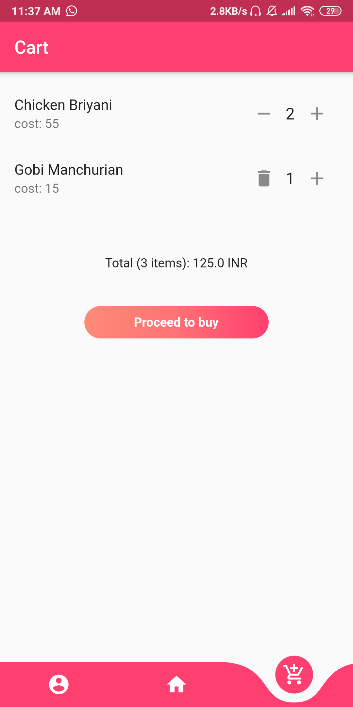

## Order Details

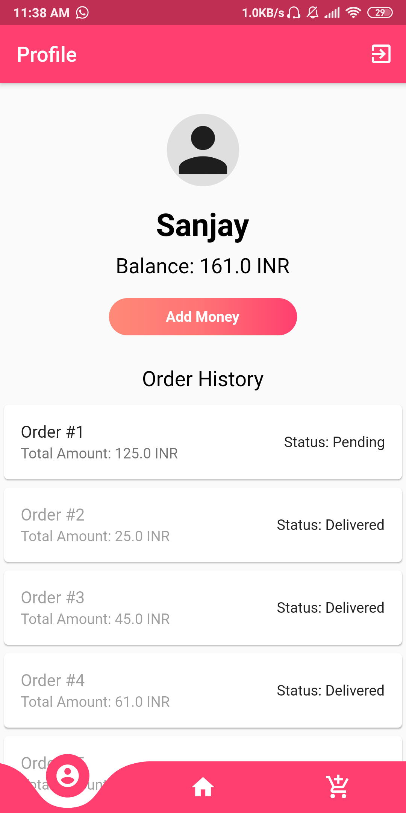
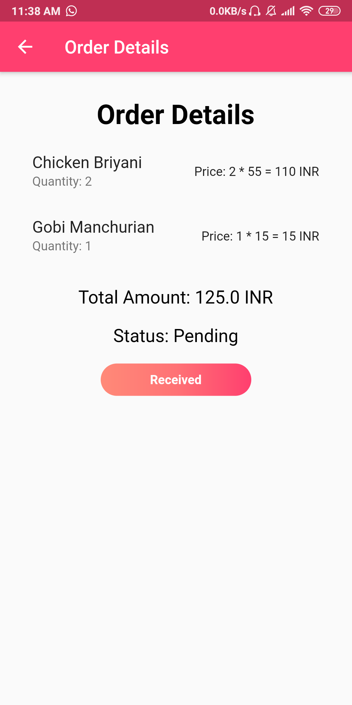
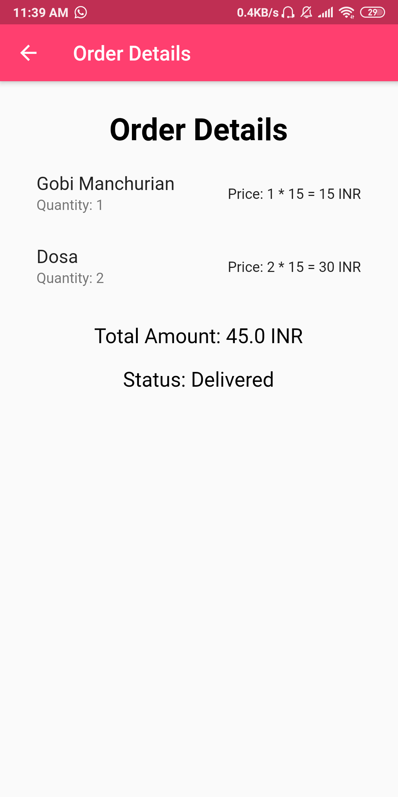

## Payment & Wallet 

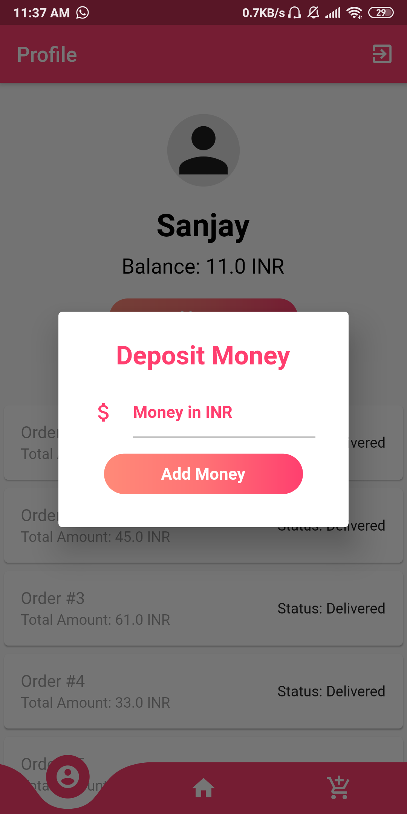
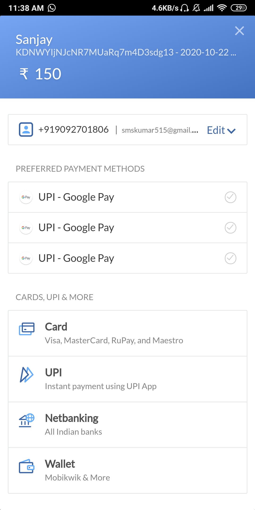

## Admin Features

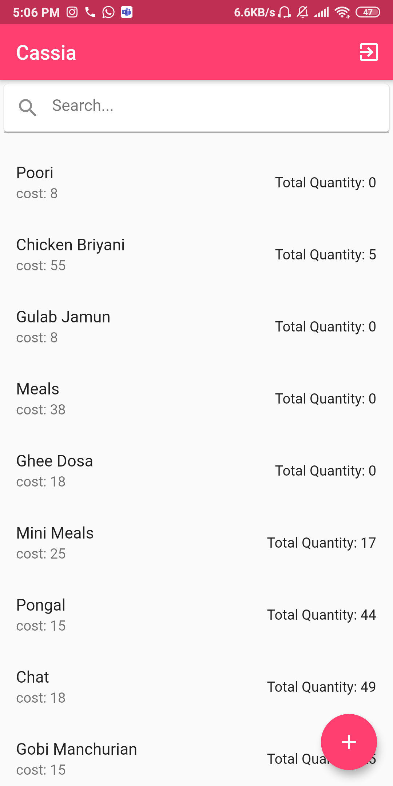
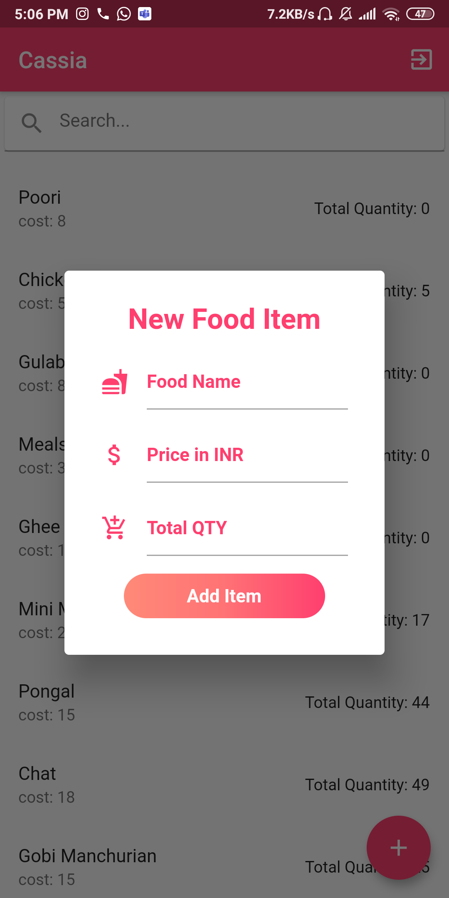
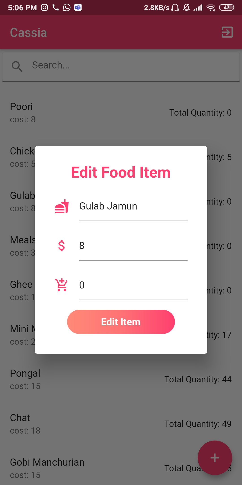
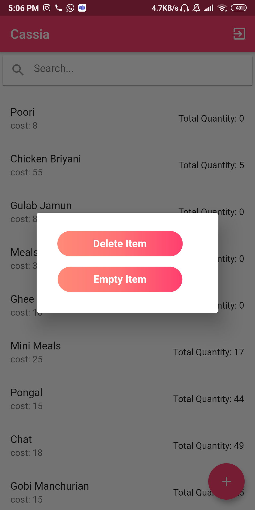

## Tools Used

1. Framework - Flutter
2. Language - Dart
3. Database - Firebase Firestore
4. Payment Gateway - Razor Pay
5. IDE - Visual Studio Code
6. Version Control - Git

## Create a similar setup

1. Clone or download this repository.
2. Open the folder in Visual Studio Code.
3. Install all the dependencies using pub get.
4. Connect an android device with debugging turned on or an emulator.
5. Build and Run the application.
6. Once it is successfully built and installed, enjoy using it!

## Future Works

The mobile application for Canteen food ordering was build to reduce the waiting time in the queue as well as to encourage e-payment to reduce the usage of cash. The future enhancements include QR code generation, for now the application has a “Received” button which is pressed by the waiter after they
deliver the food which can be reduced by generation of a QR code for every order placed which can be scanned in the Admin Application that is provided with a QR code scanner. Once the code is scanned the order status is marked as delivered.

## Contributions

Contributions are welcome. Please read the [contributions guide](CONTRIBUTING.md) for more information.
